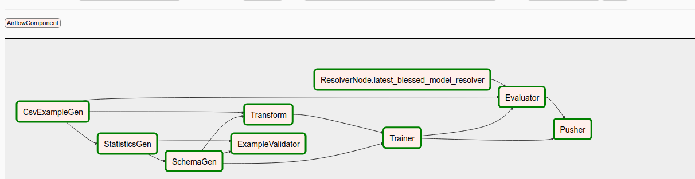

## MLOps_Pipeline_project

[TensorFlow Extended (TFX)](https://tensorflow.org/tfx) is a
Google-production-scale machine learning platform based on TensorFlow. It
provides a configuration framework to express ML pipelines consisting of TFX
components. 

The Graph view of DAG of TFX Airflow Pipeline is shown below,

### Reference TFX Airflow Pipeline code

[Airflow Reference 01](https://github.com/tensorflow/tfx/tree/master/tfx/examples/chicago_taxi_pipeline)
[Airflow Reference 02](https://github.com/GoogleCloudPlatform/mlops-on-gcp/blob/master/continuous_training/composer/solutions/chicago_taxi_dag.py)
